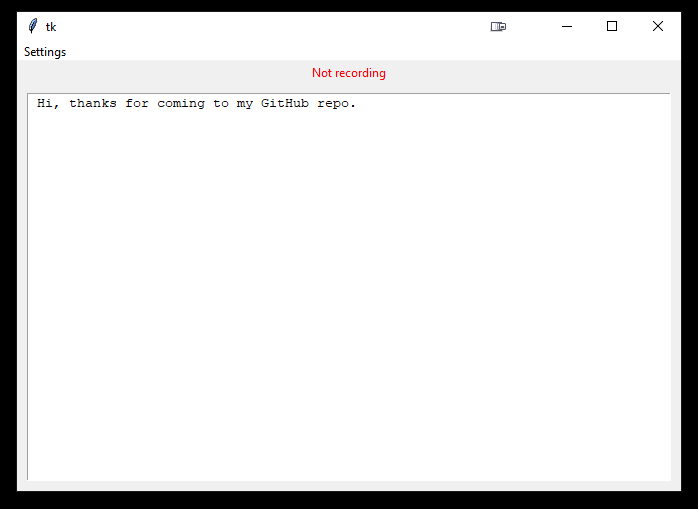

# A front-end, "real-time" implementation for Whisper

**Features:**
- Keyboard emulation to "type" your transcription into the currently active text box (can be disabled via settings).
- Option to save audio (can be enabled via settings).
- Local logging of prior transcriptions.
---
**While running, hold `F9` to record.**

**Release when you're done talking.**

# This is a work in progress

It might crash.

It might crash your audio device (though, I think I've fixed that).

# How to run
- Install [Python 3.10.9](https://www.python.org/downloads/release/python-3109/)

Then either
- `git clone` this repo 

 or 
- Click the green `Code` button on the top right, `Download ZIP`, and extract to wherever you want it.

Then
- `run.bat`

## todo
- Wrangle `pyinstaller` to correctly include `whisper` for a pre-built version.
- Allow custom hotkey for audio recording.
- Test on other systems to make sure it's capturing the audio device correctly.
- Clean up the jank.